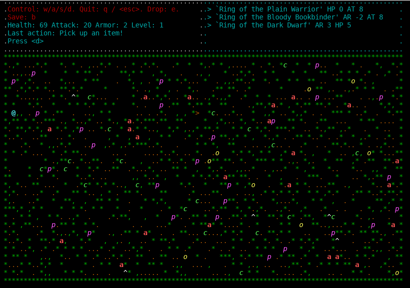

# RGL
[](https://travis-ci.org/Fatalll/RGL)

Rogue-like игра для сдачи домашнего задания по проектированию ПО

```
usage: RGL
 -f <arg>   Path to the user rgl.map.
 -g         Generate a random rgl.map.
 -i <arg>   IPv4 address of the server to connect to.
 -l         Load game if present.
 -n         Create new server.
 -p <arg>   Port of the server to connect to.
 -r         Request available servers list.
 -s <arg>   Server name to connect to.
```
  
Пример использования:

```
rgl -p 8888                          // start server on port 8888
rgl -p 8888 -i localhost -n -s test  // connect to server, create session with name 'test' and start the game
rgl -g                               // start singleplayer game with a random map
```



